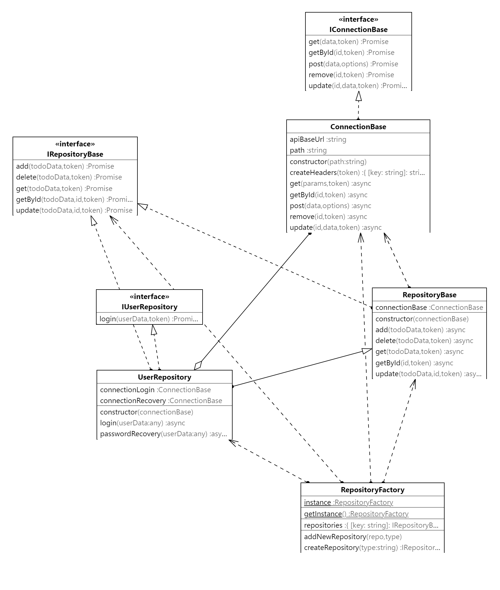

# Usage 

## Notes

If you need authentication, you need to set into localstorage. 
```
localStorage.setItem('authToken') 
```
## Usando o repository diretamente
Como usar esta biblioteca. In this example, we create a RepositoryBase for a entity todo. This RepositoryBase has the CRUD default operations like, create update, delete, list... 

```
    const repo = RepositoryFactory.getInstance();
    //asking for a new repository base class having: add, get, update, remove, delete actions..
    repository = repo.createRepository('todo');//Getting an instance of repository
    data = { id: 1, title: 'Test Todo' };
    const dataCreated = await repository.add(data,token); // Creating a new tudo into the system.
    ;
  }
  ....

```
## Usando o caso de uso generico ou o authusecase
```
   const authUseCase = new AuthUseCase();
    //action.execute(form)
   
    authUseCase.login(formData).then(token => {
        alert('Logged in successfully, token:'+ token);
        console.log('Logged in successfully, token:', token);
    }).catch((error: Error) => {
        alert('Login failed:'+ error.message);
        console.error('Login failed:', error.message);
    });
```

# Config

Use .env for configuring URL API

NODE_ENV=homologation
API_URL=http://localhost:5068


## Install 

```
npm install 
```

## Build 
```
npm run build 
```

## Running tests
```
npm run test

Test Suites: 2 passed, 2 total
Tests:       15 passed, 15 total

```

## Documentation 

